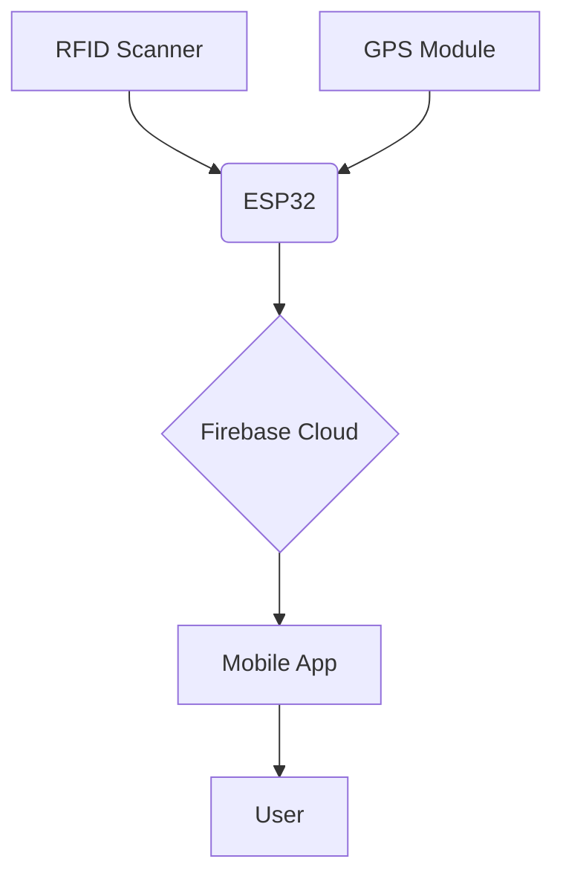

# Smart School Bus Tracking & Attendance System 🚌📱

A comprehensive solution for real-time school bus tracking and automated student attendance using RFID technology, GPS tracking, and Firebase integration.


## Key Features ✨
- **Real-time GPS Tracking** - Live bus location updates every 10 seconds
- **RFID-based Attendance** - Automatic student check-in/check-out
- **Firebase Backend** - Secure cloud storage for all data
- **Mobile Dashboard** - React Native app for admin/parent monitoring
- **Historical Data** - Attendance records and route history
- **Emergency Alerts** - Instant notifications for route deviations

## Circuit diagram


## Hardware Components 🛠️
| Component | Quantity | Purpose |
|-----------|----------|---------|
| ESP32 WROVER | 1 | Main controller |
| RFID RC522 | 1 | Student ID scanning |
| NEO-6M GPS | 1 | Location tracking |
| 18650 Battery | 2 | Power supply |
| RFID Cards | 20+ | Student identification |

## Software Stack 💻
**Backend Services**
- Firebase Realtime Database
- Firebase Authentication

**Mobile Application**
- React Native

**ESP32 Firmware**
- C 
- MFRC522 RFID Library
- TinyGPS++ Library

## System Architecture 📡

# 🚍 Mobile App


A smart bus tracker built with Expo React Native, delivering real-time transit updates, route planning, and seamless commuting.

<div align="center">
  
  
  
</div>


## 🛠 Tech Stack
| Category          | Technology                          |
|-------------------|-------------------------------------|
| Framework         | Expo React Native                   |
| Language          | JavaScript                          |
| Styling           | NativeWind (Tailwind for RN)        |
| Navigation        | React Navigation                   |
| Backend           | Firebase (Auth, Firestore, Cloud Functions) |
| Maps              | Google Maps API                    |

## 🚀 Getting Started

### Prerequisites
- Node.js (v18 or later)
- Expo CLI (`npm install -g expo-cli`)
- Yarn or npm

### Installation
```bash
# Clone the repository
git clone https://github.com/your-username/tars-mobile.git
cd tars-mobile
```
### Install dependencies

### Setup environment
```bash
cp .env.example .env
```
### Add your API keys in the app.json file
### Add the firebase configuration file to the config folder

### Start the development server
```bash
npx expo start
```

## 📬 Contact

**H.M.A. Yasitha Herath** : 2021/E/045 : amodhwork@gmail.com

2020/E/131 : RATHNAYAKE U.S 

2021/E/038 : NUGEGODAARACHCHI G.L 

2021/E/090 : BANDARA S.C.M 


**GitHub:** @amodhyh
