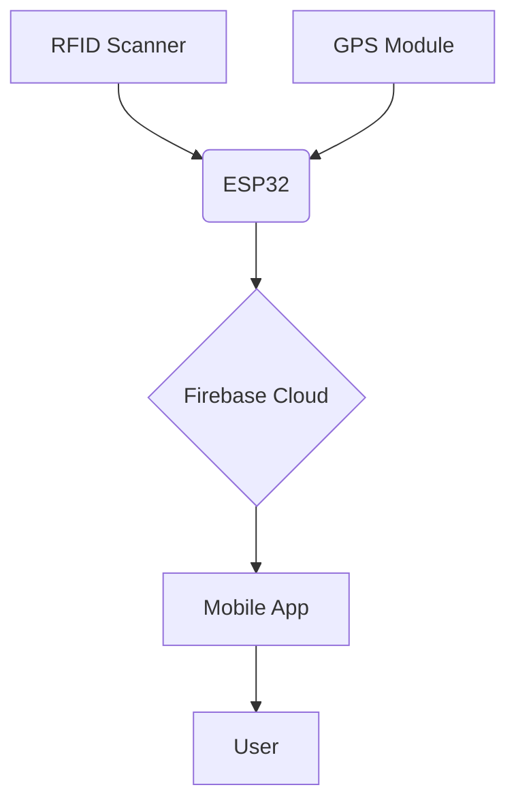

# Smart School Bus Tracking & Attendance System 🚌📱

A comprehensive solution for real-time school bus tracking and automated student attendance using RFID technology, GPS tracking, and Firebase integration.

 *Add actual system diagram screenshot*

## Key Features ✨
- **Real-time GPS Tracking** - Live bus location updates every 10 seconds
- **RFID-based Attendance** - Automatic student check-in/check-out
- **Firebase Backend** - Secure cloud storage for all data
- **Mobile Dashboard** - React Native app for admin/parent monitoring
- **Historical Data** - Attendance records and route history
- **Emergency Alerts** - Instant notifications for route deviations

##Circuit diagram

## Hardware Components 🛠️
| Component | Quantity | Purpose |
|-----------|----------|---------|
| ESP32 WROVER | 1 | Main controller |
| RFID RC522 | 1 | Student ID scanning |
| NEO-6M GPS | 1 | Location tracking |
| 18650 Battery | 2 | Power supply |
| RFID Cards | 20+ | Student identification |

## Software Stack 💻
**Backend Services**
- Firebase Realtime Database
- Firebase Authentication

**Mobile Application**
- React Native

**ESP32 Firmware**
- C 
- MFRC522 RFID Library
- TinyGPS++ Library

## System Architecture 📡

